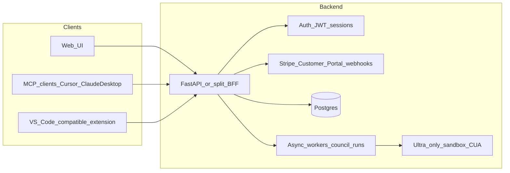

# TheCouncil full SaaS roadmap

## Current baseline (what exists today)

- **[api.py](api.py)**: FastAPI with `POST/GET /runs`, single shared **Bearer** token via `API_SECRET_KEY` (not multi-user SaaS auth).
- **[run_state.py](run_state.py)**: In-memory `RunStore` + `RunQueue` (lost on restart; single process).
- **[subscriptions.py](subscriptions.py)**: Four tiers (**Starter $10, Pro $50, Business $100, Enterprise $200**) with `UsageLimits` and Stripe helpers; webhook handler **does not persist** tier to a user record yet (see comment at [api.py](api.py) ~239–243).
- **[council.py](council.py) / [personalities.py**](personalities.py): Rich debate engine; custom/generated personas today are **filesystem-oriented** (local JSON), not per-tenant cloud objects.

Your desired commercial model (**14-day trial, Basic $10, Pro $20, Ultra $200, Enterprise $25-$215 per seat**, persona caps, Pro+ IDE/MCP plugins, Ultra computer + CUA, Enterprise SSO + centralized billing) **replaces** the current tier matrix and requires new limit dimensions (e.g. `max_custom_personas`, `computer_use_enabled`, `sso_enabled`).

---

## Product tier matrix (target)

| Tier           | Price            | Usage                                                                 | Custom personas (saved) | Plugins / integrations                                                                                                                                                               |
| -------------- | ---------------- | --------------------------------------------------------------------- | ----------------------- | ------------------------------------------------------------------------------------------------------------------------------------------------------------------------------------ |
| **Trial**      | $0 for 14 days   | Same as chosen paid tier or a fixed “preview” cap (decision)          | Per policy below        | Read-only or limited (decision)                                                                                                                                                      |
| **Basic**      | $10/mo           | **Limited** (low runs/tokens; conservative caps)                      | **1**                   | Web + API only (no IDE bundle)                                                                                                                                                       |
| **Pro**        | $20/mo           | **Higher** (not “max”)                                                | **10**                  | **MCP** (Cursor, Claude Desktop, etc.) + **custom MCP servers**; market VS Code–compatible extension for **Windsurf / Copilot**-style editors as one codebase where possible         |
| **Ultra**      | $200/mo          | **Effectively unlimited** (define fair-use / abuse policy in ToS)     | **Unlimited**           | All Pro features + **sandboxed computer** (browser/VM) + **CUA-class** model access in that environment                                                                              |
| **Enterprise** | $25-$215/seat/mo | **Configurable from Pro-level to Max** based on contract and fair-use | **Unlimited**           | Everything in Pro, plus enterprise controls: **centralized billing**, **SSO (SAML/OIDC)**, optional **SCIM provisioning**, role-based admin controls, and org-level usage visibility |

**Clarifications to bake into implementation (not blockers for planning):**

- **“Unlimited”** in practice: set very high numeric caps or a fair-use policy; true infinity is a cost and abuse risk.
- **Third-party products (Claude.ai, ChatGPT, ChatGPT non-coding):** You cannot ship an official “inside Claude.ai” plugin without that vendor’s program. The realistic pattern is: **your hosted API + MCP** (and OAuth/API key where allowed) so users connect **their** tools to **your** backend. Marketing should match what you actually ship (avoid implying unauthorized embedding inside those apps).
- **Ultra “computer + CUA”:** This is a **separate subsystem** (e.g. ephemeral Linux/browser sandboxes: E2B, Modal, Daytona, Browserbase-class stack). It is not a small add-on to the current Python worker.

---

## High-level architecture

1. **Identity & tenancy**: Real user accounts (`user_id`), org/team optional later; API keys for automation (Basic+) scoped per user.
2. **Persistence**: Move runs, personas, usage counters, and Stripe customer/subscription state to **Postgres** (replace in-memory store for production paths).
3. **Billing**: Stripe **Products/Prices** for Basic, Pro, Ultra, Enterprise + **14-day trial** on the chosen price (or a dedicated trial flow). Webhooks: `customer.subscription.`*, `invoice.`*, `checkout.session.completed`—persist `stripe_customer_id`, `subscription_id`, `tier`, `trial_end`, `status`.
4. **Entitlements**: Central module (evolve `tier_allows_feature` / `UsageLimits` in [subscriptions.py](subscriptions.py)) checked on **every** run and **every** plugin tool call.
5. **Web UI**: New frontend (e.g. **Next.js** or **Vite + React**) with a strong design system (e.g. Tailwind + accessible components), dashboards for runs, personas, usage, billing portal link, and docs for MCP install.

---

## IDE / “plugin” strategy (pragmatic)

- **Primary delivery (Pro+/Enterprise):** **Remote MCP server** (HTTP/SSE) with `Authorization: Bearer <user_api_key>`—aligns with how Cursor and Claude Desktop consume MCP ([Cursor MCP docs](https://cursor.com/docs)).
- **Secondary:** One **Open VSX / VS Marketplace** extension (VS Code API) covering editors that support the same extension model (Windsurf, many Copilot Chat surfaces). Same backend; different thin client.
- **“Custom MCP servers” on Pro:** Allow users to register **URLs + secrets** for outbound MCP connections **from your worker** only if you accept the security/compliance burden; otherwise phase 2 “bring your own MCP” via local-only config.

---

## Phased delivery (recommended)

### Phase 1 — SaaS foundation (blocking everything else)

- Introduce **Postgres** + migrations (e.g. Alembic + SQLAlchemy 2.0, or SQLModel).
- **Auth**: Hosted auth (Clerk, Auth0, Supabase Auth) or FastAPI-users-style email/OAuth; issue **session** for web and **API keys** for plugins.
- Replace dev-only bearer equality with **per-user tokens**; keep a migration path for local dev.
- Implement **Stripe** subscription lifecycle + **Customer Portal**; map webhooks to `user.tier` and trial state.
- **Usage metering**: Monthly counters for runs/tokens; enforce before enqueueing council work.

### Phase 2 — Web app (beautiful UI)

- Marketing + authenticated app: onboarding, pricing, **persona builder** backed by DB (port concepts from [council.py](council.py) generated persona flows).
- Run history, exports gated by tier (reuse existing flags in `UsageLimits` where they still apply).

### Phase 3 — Pro plugins

- Ship **TheCouncil MCP** package (Node or Python MCP SDK) pointing at your API.
- Documentation: one-click `mcp.json` snippets and API key rotation.
- Optional VS Code extension wrapping the same operations.

### Phase 4 — Ultra (computer + CUA)

- Dedicated **sandbox service** + strict network/tool policy; queue jobs that run **only** for Ultra entitlements.
- Choose CUA-capable model **without changing your default OpenAI model** elsewhere (per your project rule: do not swap user’s model unless asked—Ultra can be a **separate** configurable deployment default for sandbox only).

---

## Codebase touchpoints (when implementing)

- **[subscriptions.py](subscriptions.py)**: Rename/replace `TierName` with `free_trial | basic | pro | ultra | enterprise` (or keep internal names + display map); extend `UsageLimits` with `max_saved_personas`, `ide_plugins_enabled`, `custom_mcp_enabled`, `computer_use_enabled`, `sso_enabled`, `centralized_billing_enabled`; update [tests/test_subscriptions.py](tests/test_subscriptions.py) accordingly.
- **[api.py](api.py)**: Add auth dependency injection from real user context; middleware for usage limits; webhook handlers that **write to DB**.
- **New packages/dirs** (minimal file sprawl): e.g. `web/` frontend, `mcp-server/` or `plugins/mcp/`, `db/` models—keep count low per your preference.

---

## Risks and decisions for you

1. **Trial semantics**: Is “Free 2 week trial” **(a)** time-limited access to Pro features then paywall, **(b)** Stripe trial on Basic/Pro checkout, or **(c)** a permanent free tier after trial? This changes Stripe catalog and enforcement.
2. **Ultra compute budget**: Sandboxed environments are **expensive**; you may need queueing, concurrency caps, or add-on metering even at $200.
3. **Compliance**: Storing user persona data and running arbitrary MCP tools touches **privacy** and **security** review.

This plan intentionally sequences **billing + DB + auth** before heavy UI and before Ultra sandbox work, so each phase is shippable.