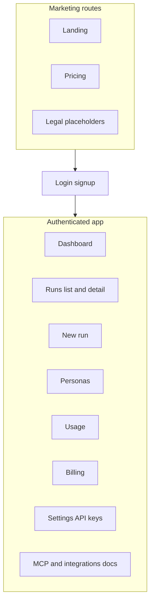

# TheCouncil Web UI — implementation plan

This plan implements **Phase 2 — Web app** from the parent roadmap: marketing plus an authenticated experience for runs, persona management, usage visibility, billing (Stripe Customer Portal), and MCP installation guidance. It assumes **Phase 1** (Postgres, real auth, Stripe persistence, usage metering) is in flight or complete enough to expose stable HTTP contracts; the UI should not hard-code the current single shared `API_SECRET_KEY` pattern for browser users.

---

## Relationship to the parent roadmap

| Parent item                                                                              | Web UI role                                                                                                |
| ---------------------------------------------------------------------------------------- | ---------------------------------------------------------------------------------------------------------- |
| Identity and API keys                                                                    | Browser uses **session** (or hosted IdP); automation keeps **API keys**. UI must reflect both in Settings. |
| Entitlements (`[subscriptions.py](subscriptions.py)` / `[GET /me/entitlements](api.py)`) | Drive **gating** (export, MCP docs visibility, persona caps, upgrade CTAs).                                |
| Stripe Customer Portal                                                                   | **Billing** page: “Manage subscription” + status (tier, trial end).                                        |
| Personas in DB                                                                           | **Persona builder** and list; server enforces `max_saved_personas` per tier.                               |
| MCP for Pro+                                                                             | **Docs** page or section with `mcp.json` snippets and API key rotation.                                    |

---

## Prerequisites (backend contracts the UI depends on)

These are **not** optional for a production-quality web app; they belong to Phase 1 but define what the frontend team can assume.

1. **Browser-safe auth** — Cookie session or JWT from your chosen provider; **not** raw Bearer equality with a global secret. Existing `[require_auth](api.py)` patterns evolve to resolve `AuthContext` from session or API key.
2. **CORS** — FastAPI `[CORSMiddleware](https://fastapi.tiangolo.com/tutorial/cors/)` (or reverse-proxy headers) for the web origin(s).
3. **Billing actions** — Endpoints or redirects the UI can call: e.g. Stripe **Checkout** for subscribe/upgrade and **Customer Portal** for manage/cancel (parent plan: webhooks persist tier; UI reads tier from `/me/entitlements` or a dedicated `/me/billing` summary).
4. **Personas API** — CRUD under something like `/personas` (or `/me/personas`) backed by Postgres; enforce caps using existing `UsageLimits.max_saved_personas` from `[subscriptions.py](subscriptions.py)`.
5. **Usage dashboard** — Prefer `**GET /me/usage`** (or extend `/me/entitlements`) with month-to-date runs and token estimates vs limits; aligns with “usage metering” in the parent plan.
6. **Run list semantics** — `[GET /runs](api.py)` today lists in-memory runs; once DB-backed, add **pagination** and optional filters so the UI scales.

Until (1)–(3) exist, the UI can be **stubbed against mocks** or a dev-only API key flow only for internal demos—not for users.

---

## Recommended frontend stack (aligned with parent doc)

- **Framework:** **Next.js (App Router)** — strong defaults for **marketing SEO** (landing, pricing), route groups for `(marketing)` vs `(app)`, and API Route Handlers only if you need a thin BFF (optional; prefer calling FastAPI directly with cookies if same-site or CORS is configured).
- **Alternative:** **Vite + React + React Router** if you want a single SPA and accept lighter SEO or prerender only for a few pages.
- **Styling:** **Tailwind CSS** + accessible primitives (**Radix UI** or **Headless UI**) — matches “Tailwind + accessible components” in the roadmap.
- **Data:** **TanStack Query** for server state (runs, entitlements, personas, usage); minimal client state for forms and wizard steps.
- **Location:** Single top-level `**[web/](web/)`** directory in the repo (parent “minimal file sprawl”).

---

## Information architecture and features

### Marketing (public)

- **Landing** — Value prop, link to pricing, primary CTA (sign up / start trial).
- **Pricing** — Table consistent with the **target tier matrix** in the parent plan (Trial, Basic $10, Pro $20, Ultra $200, Enterprise); copy must **not** over-claim third-party app embedding (per parent “Claude.ai / ChatGPT” note).
- **Legal** — Placeholder pages for Privacy / Terms (content out of scope for engineering plan).

### Authenticated app

| Area                   | Behavior                                                                                                                                                                                                                                                                                                                  |
| ---------------------- | ------------------------------------------------------------------------------------------------------------------------------------------------------------------------------------------------------------------------------------------------------------------------------------------------------------------------- |
| **Dashboard**          | Snapshot: current tier, trial countdown if applicable, usage vs limits, recent runs, quick actions.                                                                                                                                                                                                                       |
| **Runs**               | List with status, created time; **detail** with polling or SSE/WebSocket later for live status; **create run** form (question + optional config: agents, rounds, tokens) with client-side hints from `/me/entitlements` limits.                                                                                           |
| **Export**             | If `export_enabled` is false for tier, show disabled state with upgrade path (from `[UsageLimits](subscriptions.py)`).                                                                                                                                                                                                    |
| **Personas**           | List saved personas (up to cap), create/edit/delete; **builder** can reuse concepts from `[personalities.py](personalities.py)` (canned vs MBTI-generated profiles) as **templates** that serialize to stored JSON the council worker already understands. Block saves when at `max_saved_personas` with clear messaging. |
| **Usage**              | Bars or numbers for runs (and tokens when API provides them) vs monthly caps; link to upgrade.                                                                                                                                                                                                                            |
| **Billing**            | Current plan, renewal/trial end, **Stripe Customer Portal** button; Enterprise contact CTA if applicable.                                                                                                                                                                                                                 |
| **Settings**           | API key list/create/revoke (masked), optional profile email from IdP.                                                                                                                                                                                                                                                     |
| **MCP / integrations** | Shown when `mcp_enabled` / `ide_plugins_enabled` — install steps, `Authorization: Bearer`, link to rotation in Settings. Pro-only **custom MCP** UI only if backend supports registration.                                                                                                                                |

### Onboarding

- Post-signup flow: confirm tier (trial vs paid), short tour, generate or show first API key, link to MCP docs if Pro+.

---

## API integration summary

| UI surface      | Existing / planned endpoint                                      |
| --------------- | ---------------------------------------------------------------- |
| Tier and limits | `[GET /me/entitlements](api.py)`                                 |
| Runs            | `[POST/GET /runs`, `GET /runs/{id}](api.py)`                     |
| Usage           | New `GET /me/usage` (recommended)                                |
| Personas        | New CRUD under FastAPI                                           |
| Billing         | New checkout/portal session creation + read subscription summary |
| Health          | `[GET /health](api.py)` for ops; optional status page            |

Use **OpenAPI** (`/openapi.json`) or a small generated TypeScript client to keep types in sync with `[api.py](api.py)`.

---

## UX and quality bar

- **Responsive** layout; keyboard navigation and focus states (Radix helps).
- **Empty states** for first-time users (no runs, no personas).
- **Error handling** — 401 → login; 429 → usage limit with upgrade; 402/403-style responses if you add them for paywalled features.
- **Loading/skeleton** states for lists and entitlements-dependent panels.

---

## Testing and deployment

- **Vitest + React Testing Library** for components; **Playwright** for critical paths (login stub, create run, open billing) — consistent with repo tooling preferences.
- **Build:** `web` as its own package; CI runs `lint`, `typecheck`, `test`, `build`.
- **Deploy:** Static export or Node hosting for Next.js; environment variables for `NEXT_PUBLIC_API_BASE_URL` (FastAPI origin). Production should use **HTTPS** and secure cookies.

---

## Suggested implementation order

1. **Scaffold `web/`** — Next.js, Tailwind, ESLint, app shell, design tokens.
2. **Marketing pages** — Landing + pricing (static content from parent matrix).
3. **Auth integration** — After Phase 1 auth is available, wire login/signup and protected layout.
4. **Entitlements-driven shell** — Fetch `/me/entitlements`, hide/show nav items (MCP docs, etc.).
5. **Runs** — List/detail/create with polling; respect limits from responses and 429 handling.
6. **Usage + billing** — Wire usage endpoint and Stripe portal button when backend endpoints exist.
7. **Personas** — List/builder once CRUD API exists; gate by `max_saved_personas`.
8. **Polish** — Onboarding, empty states, a11y pass, Playwright smoke tests.

---

## Out of scope for this Web UI plan (handled elsewhere)

- **Ultra sandbox / CUA** — Only surface **“available on Ultra”** messaging and navigation guards if `computer_use_enabled`; actual sandbox UI is Phase 4.
- **VS Code extension** — Link only; separate package per parent Phase 3.

